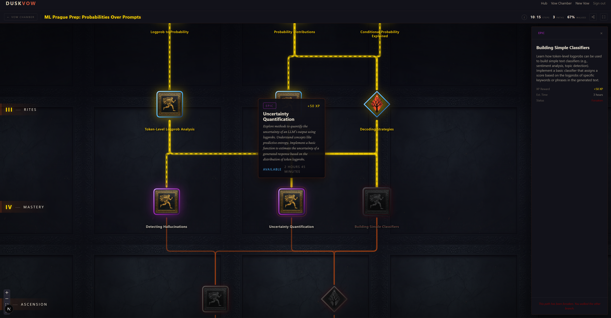
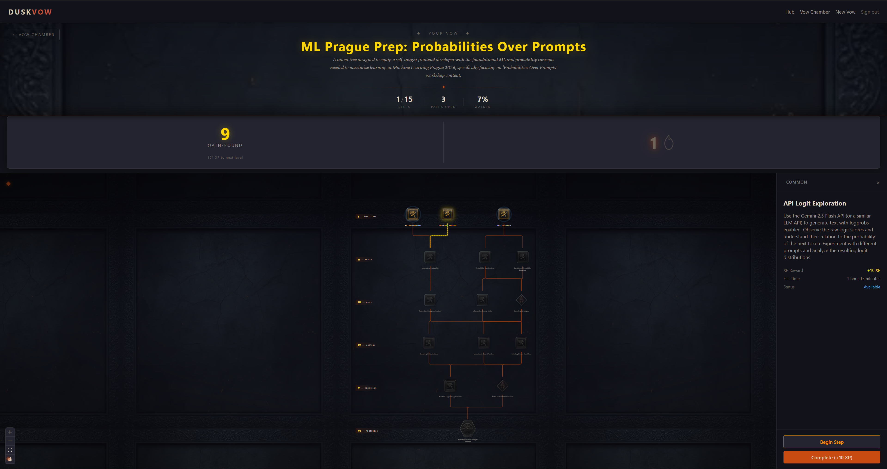
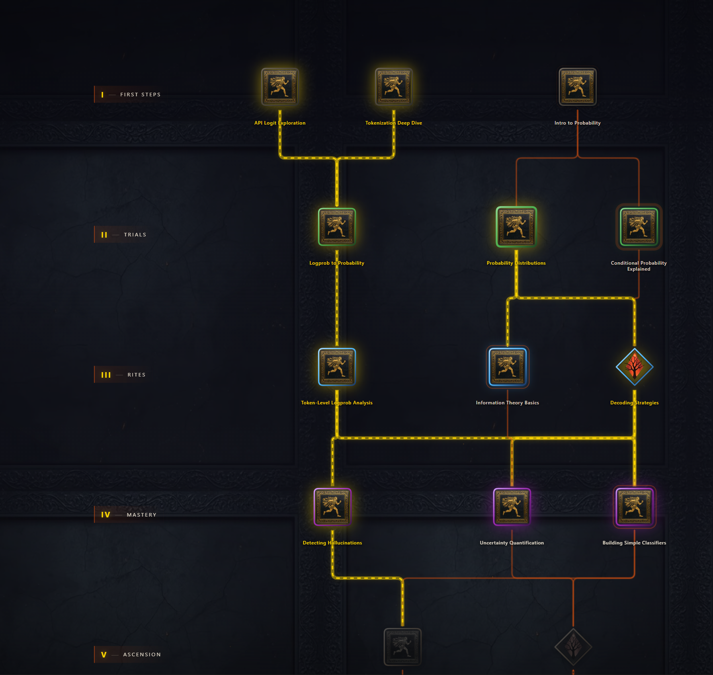
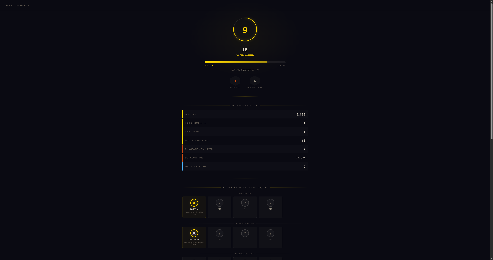
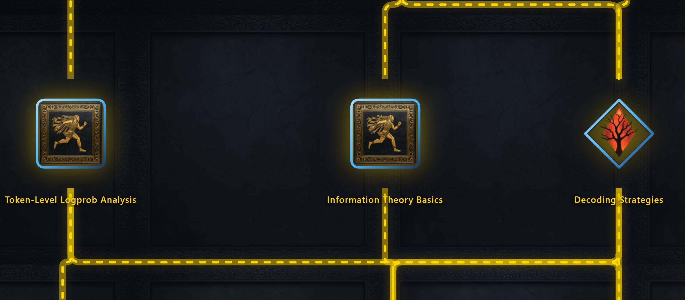

# Duskvow

> **Self-improvement, reforged.** Speak your goal — an AI forges it into a dark-fantasy talent tree you walk at your own pace.


> ⚠️ **Project status — archived.** Duskvow is no longer maintained. The Supabase backend has been torn down, so the live app will not run end-to-end without standing up your own project. This repository is preserved as a portfolio artifact and reference implementation.

---

## What it was

Duskvow was a portfolio-scale, full-stack experiment in turning self-improvement into something that doesn't feel like a spreadsheet. Most habit apps look like Excel — Duskvow looked like Dark Souls.

You typed a goal in plain English ("prepare for my ML interview", "learn to draw faces", "finish my thesis"). Google Gemini parsed it into a hierarchical **talent tree** of 15–25 skill nodes across six tiers, each with XP, estimated time, and a short flavored description. You then "walked" the tree — completing nodes unlocks downstream ones, earning XP, leveling your hero, and shifting your weekly leaderboard rank.

The vibe is intentional: a vow is heavier than a task, a path is more committal than a checklist, and a tree of glowing skill nodes is more motivating than a flat to-do list.

## How it works



1. **Make a vow.** A short wizard collects your goal and a few clarifying answers (current level, time available, deadline).
2. **The forge.** The backend wraps your input in a tightly-constrained Jinja prompt and calls **Gemini 2.5 Pro**. The response is a JSON tree: 15–25 nodes, six tiers (Foundations → Rites → Mastery → Ascension → …), each tagged with a shape (habit / action / choice / keystone), rarity (common → mythic), XP reward, and estimated minutes.
3. **Layout & validation.** The AI output is validated against a Pydantic schema, clamped (XP, node count, length caps) to prevent prompt-injection inflation, then laid out by **Dagre** so the tree always looks clean — the AI doesn't get to pick positions.
4. **Walk the tree.** The frontend renders the tree with React Flow on a hand-painted parchment background. Locked nodes are dimmed; available ones pulse; completed ones turn gold. Clicking a node opens a side panel — clicking *Complete* fires an optimistic Zustand update (<300ms feedback) and a backend PATCH.
5. **Progression layer.** XP feeds a global hero level, a daily streak (with multiplier), a weekly leaderboard, and an achievement / inventory system. Mobile gets a thumb-friendly bottom-sheet variant of the same flow.

## Gallery

<table>
  <tr>
    <td width="50%"><br/><em>Hub — active vow with progress, step count, walked-percent</em></td>
    <td width="50%"><br/><em>A full tree — six tiers from First Steps to Ascension</em></td>
  </tr>
  <tr>
    <td width="50%"><br/><em>Hero profile — level ring, XP bar, streak, achievement grid</em></td>
    <td width="50%"><br/><em>Hand-painted node icons on the locked 12-color palette</em></td>
  </tr>
</table>

## Key features

- **AI-forged talent trees** — Gemini 2.5 Pro, validated and rarity-clamped, with a fast 2.0-flash fallback path explored for shorter prompts.
- **Six-tier dagre layout** — deterministic, no overlap, no AI position drift.
- **Optimistic node completion** — Zustand store updates immediately, reverts on API failure.
- **Hand-painted aesthetic** — Krita-painted node icons on a 12-color locked palette, Cinzel + Crimson Pro typography, no pure black/white anywhere.
- **Progression system** — hero level + title, weekly XP leaderboard, daily streak multiplier, achievements, inventory.
- **Rate-limited generation** — 2 trees / day on the free tier, enforced server-side.
- **Mobile-first** — responsive tree canvas, node detail bottom sheet, hamburger nav.
- **GDPR-compliant** — cookie consent gate, account deletion (Art. 17), data export (Art. 20).

## Tech stack

| Layer | Stack |
|---|---|
| Frontend | Next.js 16 (App Router), TypeScript strict, Tailwind v4, Zustand, React Flow (`@xyflow/react`), Dagre |
| Backend | Python 3.11+, FastAPI, Pydantic v2, async everywhere |
| Database | Supabase Postgres + Row-Level Security + Auth |
| AI | Google Gemini 2.5 Pro (quality) / 2.0 Flash (fast path) |
| Hosting | Vercel (frontend) + Railway (backend) |

## Architecture

```
frontend/src/
  app/            Next.js routes (landing, /vows, /tree, /profile, /leaderboard, /dungeon)
  components/     tree/, ui/, layout/, tree-wizard/, auth/
  hooks/          React hooks (auth, tree-store binding, mobile detection)
  lib/            api.ts (all backend calls), supabase.ts (browser client)
  stores/         Zustand stores (tree, progression)
  types/          Shared TS types

backend/app/
  api/v1/         FastAPI routers (trees, nodes, profile, leaderboard, quests, dungeon, export)
  core/           Config, auth dependency, error handling
  schemas/        Pydantic v2 request/response models
  services/       Gemini client, Supabase admin client, business logic
  prompts/        Jinja2 templates for AI calls
  data/           Static JSON (dungeon pools, achievement catalog)

supabase/migrations/  Versioned SQL with RLS policies + atomic RPCs
```

## Notable engineering decisions

- **PostgREST is the threat surface, not FastAPI.** Because Supabase exposes the DB directly to authenticated browsers, the security model relies on RLS, not on FastAPI being a chokepoint. All progression tables had user-writable UPDATE policies *dropped*, and every `SECURITY DEFINER` RPC was REVOKE'd from `PUBLIC` / `authenticated` — the backend writes via `service_role` only. See `supabase/migrations/20260416_security_hardening.sql` and `SECURITY_AUDIT_2026-04-16.md`.
- **AI output is never trusted.** Tier→XP mapping is canonical (prompt-injection can't inflate rewards), node counts are clamped to 15–25, title/description lengths are bounded, and the whole response is Pydantic-validated before it touches the database.
- **Atomic Postgres RPCs for XP / streak / daily generation.** No read-modify-write from the backend — increments are RPCs so concurrent requests can't double-count.
- **Layout is deterministic.** Dagre owns positions; the AI only owns content. This was a hard lesson — early versions let the AI place nodes and they overlapped constantly.
- **The dungeon is template-based, not AI-generated.** Combat events, monster pools, and loot tables are curated JSON. Randomness is weighted selection, not generation. This means zero API cost per focus session and instant starts.

## Running locally

> The Supabase project this repo was built against has been deleted, so you'll need to provision your own.

```bash
# 1. Frontend
cd frontend
cp .env.example .env.local        # fill in NEXT_PUBLIC_SUPABASE_URL, _ANON_KEY, NEXT_PUBLIC_API_URL
npm install
npm run dev                       # http://localhost:3000

# 2. Backend
cd backend
cp .env.example .env              # fill in SUPABASE_URL, _SERVICE_ROLE_KEY, _JWT_SECRET, GEMINI_API_KEY
python -m venv .venv && source .venv/bin/activate   # or .venv\Scripts\activate on Windows
pip install -r requirements.txt
uvicorn app.main:app --reload     # http://localhost:8000

# 3. Database
npx supabase db push              # applies all migrations to your project
```

You'll need a Google AI Studio API key for Gemini and a fresh Supabase project (free tier is fine).

## What I'd do differently — and what I learned

The real problem was never the product. It was distribution. Everyone is shipping a SaaS right now, and I never found a real way to put Duskvow in front of enough of the right people to test my actual thesis. I assumed the dark-fantasy framing was the hook — it turned out most people just didn't care about the aesthetic one way or the other.

The genuine product issue was retention. The new-tree moment was strong: people would generate a tree, say "damn, that looks cool," and then never come back. The gamification didn't have enough surface area beyond the first session to pull them in again.

What did work — and this surprised me — was **short-horizon goals**. The app was great for things like "prepare for this ML interview in 3 days" or "ship this side project this weekend." The tree gave structure, the XP gave momentum, and the time pressure did the rest. Ironically, this is the opposite of what I built it for; I was aiming at long-term self-improvement, where the retention problem hit hardest.

Next time I would:

- **Talk to people directly, much earlier.** I built the gamification stack on a personal hunch rather than on conversations with the actual target users. For me, the app worked well — I used it, I liked it. That's a sample size of one, and one I can't trust.
- **Pivot the positioning toward what's working.** Short-horizon, high-stakes prep (interviews, deadlines, exams, focused sprints) is where the loop already retained. Long-term life goals were always going to be a harder retention fight.
- **Test the gamification hypothesis properly.** I still believe RPG framing is a powerful trope, especially for people with ADHD and for gamers. But "I believe it" is not a tested claim. With more feedback cycles and a tighter audience, this could be a real product.

For now, I'm parking Duskvow to pursue other projects and to stop paying for hosting on something I'm not actively iterating on. The codebase is here, the lessons are real, and I may come back to it.

## License

Code is MIT-licensed — see [LICENSE](LICENSE). Hand-painted node assets in `frontend/public/images/nodes/` and other original artwork are © Jakub Barak, all rights reserved.

## Credits

- Built by [@jakubbarak2001](https://github.com/jakubbarak2001).
- Node icons hand-painted in Krita on a locked 12-color palette.
- Engineered with assistance from Claude Code.
